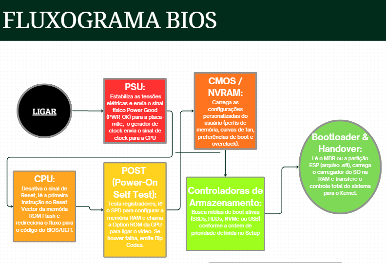
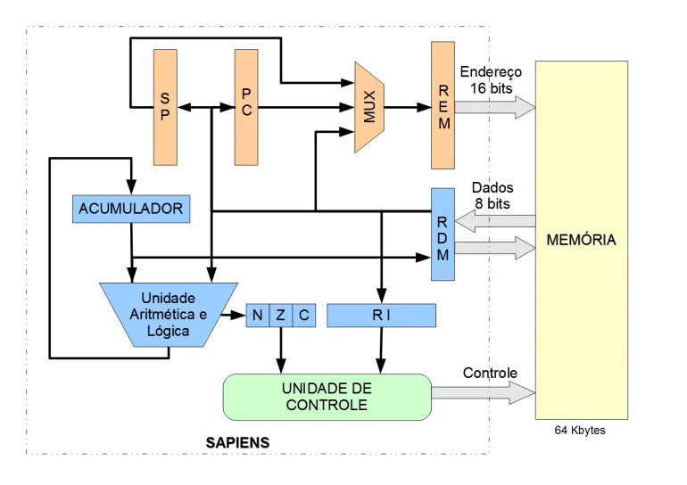

## 1. O BIOS/UEFI (O "Gerente de Abertura")

Pense no BIOS/UEFI como o gerente de uma loja que chega primeiro, acende as luzes e checa se todas as ferramentas estão funcionado antes de abrir as portas para os clientes.

O que é: Um firmware (código de baixo nível) gravado direto em um chip da placa-mãe.
UEFI: É a evolução moderna do BIOS antigo, trazendo interface gráfica, suporte a mouse, compatibilidade com discos maiores e mais segurança.

### As 4 Funções Principais:
1. POST: Assim que você liga o PC, ele testa se os componentes essenciais (RAM, Processador, Placa de Vídeo, Armazenamento) estão operando.
2. Configuração de Hardware: Permite ajustar parâmetros físicos (frequências, voltagens/overclock, perfis XMP de memória).
3. Gerenciamento de Boot: Identifica em qual disco (SSD/HD) ou pendrive está o sistema operacional e inicia o carregador de inicialização.
4. Secure Boot: Camada de segurança do UEFI que impede a execução de softwares maliciosos durante a inicialização.

---

## 2. A Passagem de Bastão (Como a CPU e o BIOS Conversam)

Este processo ocorre nos primeiros segundos após o botão de ligar ser pressionado:

1. Ponto de Partida (Endereço Fixo): Ao receber energia, a CPU zera seus registradores e busca instruções em um endereço fixo pré-programado na placa-mãe.
2. Leitura Direta: Como a memória RAM ainda não foi configurada, a CPU lê o código do BIOS/UEFI diretamente do chip usando seu relógio interno (*clock*).
3. Entrega de Controle:Após testar e configurar o hardware, o BIOS/UEFI encontra o sistema operacional (Windows/Linux), carrega os arquivos essenciais na RAM e passa o comando para a CPU executar o SO.

---

## 3. O Processador e o Sistema Operacional

### Como o Processador Funciona
O processador opera essencialmente como uma calculadora de altíssima velocidade:
* Processa dados em formato binário (`0` e `1`).
Fluxo de Trabalho: Busca dados na memória RAM  Armazena em um **Registrador** (memória interna ultra-rápida) $\rightarrow$ Executa a operação lógica/aritmética  Devolve o resultado para a RAM.

### Registradores de Endereço e Controle (Laranja/Cinza)
1. PC (Program Counter / Contador de Programa): Armazena o endereço da memória onde está a próxima instrução a ser executada. A cada instrução lida, ele é incrementado automaticamente.
2. SP (Stack Pointer / Ponteiro de Pilha): Aponta para o topo da memória RAM dedicada à pilha (stack), usada para salvar endereços de retorno em chamadas de sub-rotinas/funções ou salvar dados temporários.
3. MUX (Multiplexador): Funciona como uma "chave seletora". Ele escolhe de onde virá o endereço que será enviado para a memória em um dado momento: do PC (para buscar a próxima instrução), do SP (para operações de pilha) ou do barramento interno de dados (para acesso a variáveis em memória).
4. REM (Registrador de Endereço de Memória / MAR): Guarda temporariamente o endereço de 16 bits que a CPU precisa acessar na memória principal (permitindo endereçar até $2^{16} = 64\text{ Kbytes}$).

### Registradores de Dados e Processamento (Azul)

1. RDM (Registrador de Dados da Memória / MDR): Funciona como a "porta de entrada e saída" de dados entre a CPU e a memória. Ele armazena temporariamente a informação de 8 bits que está sendo lida da memória ou gravada nela.
2. RI (Registrador de Instrução): Armazena o código de operação (Opcode) da instrução atual que acabou de ser lida da memória para que ela possa ser decodificada.
3. Acumulador (ACC): É o registrador principal de trabalho da CPU. Ele fornece um dos operandos para as operações de cálculo e também recebe e armazena o resultado gerado pela Unidade Aritmética e Lógica.
4. Unidade Aritmética e Lógica (UAL / ALU): O "cérebro matemático" da CPU. Realiza operações aritméticas (soma, subtração) e lógicas (AND, OR, NOT) entre o dado do Acumulador e um dado do barramento.
5. N, Z, C (Registrador de Flags / Estado): Guardam o status do resultado da última operação feita pela UAL:
N (Negative): Ativado ($1$) se o resultado for negativo.
Z (Zero): Ativado ($1$) se o resultado for exatamente zero.
C (Carry): Ativado ($1$) se houve "vai-um" ou "vêm-um" (transbordo aritmético).

### Unidade de Decisão e Controle (Verde)
1. Unidade de Controle (UC): É o maestro do computador. Ela lê a instrução que está no RI, verifica as flags de estado (N, Z, C) e gera os sinais de controle elétricos que ativam ou desativam todos os outros componentes (indicando se a memória deve ler/escrever, se a UAL deve somar/subtrair, etc.).

### Componente Externo (Amarelo)
1. Memória (64 Kbytes): A memória principal externa ao bloco do processador. Onde ficam guardados tanto o programa (código) quanto as variáveis (dados), trafegando dados em palavras de 8 bits através dos endereços de 16 bits.

---

### Como o Sistema Operacional Assume o Controle

Para gerenciar múltiplos programas sem que um interfira no outro, a CPU trabalha com Modos de Execução:

| Modo | O que roda aqui? | Nível de Acesso |
| :--- | :--- | :--- |
| Modo Usuário | Aplicativos comuns (Navegador, Jogos, Word) | Restrito: Não pode acessar o hardware diretamente. |
| Modo Kernel| Núcleo do Sistema Operacional | Total: Acesso irrestrito a todo o hardware. |

#### Mecanismos de Transição e Multitarefa:

Interrupção do Temporizador (*Timer Interrupt*):** Um chip envia um sinal elétrico periódico (ex: a cada 10ms) que obriga a CPU a pausar o programa atual e dar atenção ao Sistema Operacional.
Chamadas de Sistema (*System Calls*): Quando um app precisa de algo do hardware (ex: ler um arquivo), ele faz uma solicitação (*syscall*) que força a CPU a trocar para o Modo Kernel.
Escalonador (*Scheduler*):** O SO salva o estado atual do programa na memória (**Bloco de Controle de Processo - PCB**), escolhe a próxima tarefa da fila e a carrega na CPU. Isso garante a ilusão de que vários programas rodam exatamente ao mesmo tempo.

## Onde entram os drivers e gerenciadores de recursos
 O papel dos drivers no Processador:
 Os drivers são programas que contêm instruções específicas para a CPU conversar com os componentes de hadware(placa de video, disco, rede). Quando um programa precisa usar o hadware, a CPU executa o código do driver, após o driver traduz ordens gerais do sistema em comandos diretos que o chip do dispositivo entende.

O papel dos gerenciadores de Recursos:
 O gerenciador de recursos(parte do núcleo ou kemel do sistema operacional) decide quando e quanto tempo cada processo fica na CPU. Ele utiliza um componente chamado escalanador(scheduler) para alternar rapidamente entre tarefas, dando a impressão de que tudo roda ao mesmo tempo. O gerenciador de memória configura a unidade de gerenciamento de memória(MMU) para definir quais dados vão para a memória física ou cache do processador.

 Como eles entram em ação
 Modo Núcleo/ Kernel, é o nivel mais acessado ao hadware. Os drivers e o gerenciador de recursos do sistema operacional(como o escalonador de processos e o gerenciador de memória) rodam nesse modo. Eles dão ordens diretas aos circuitos do computador. Já no modo usuário é onde rodam seus aplicativos padrões como o próprio navegador, jogos, editor de texto. Eles não tem acesso direto ao hadware e precisam pedir licença aos drivers e ao sistema.

 ## Função do driver e Gerenciador de recursos
 Gerenciador de recursos: Funcionam como uma "chefia", onde se comunicam com o processador quais tarefas executar em cada núcleo, quanto tempo cada aplicativo pode usar o processador e com a memória RAM deve ser dividida.

 Drivers: Funcioanam como um locutor ou seja se um programa quer impremir um documento, ele avisa o sistema operacional. O driver de impressão traduz esse pedido em instruções binárias e utiliza o processador para enviar os comandos de sinal elétrico corretos para a impressora.

## Papel dos barramentos e dispositivos de E/S nesse processo
 Barramentos: De forma geral os barramentos são responsáveis pela interligação e comunicação dos dispositivos em um computador. Note que, para o processador se comunicar com a memória e o conjunto de dispositivos de entrada e saída, há três setas, isto é, barramento: Um sendo chamado barramento de endereçoes, barramento de dados e barramento de controle. Como o nome deixa claro, é pelo barramento de dados que as informações trafegam. Por sua vez, o barramento de controle faz a sincronização das referidas atividades, habilitando ou desabilitando o fluxo de dados, por exemplo. Imagine que o processador necessita de um dado presente na memória. Pelo barramento de endereços(indica onde os dados processados devem ser retirados ou para onde são enviados), a CPU obtém a localização deste dado dentro da memória. Como precisa apenas acessar o dado, o processador indica pelo barramento de controle que esta é uma operação de leitura. O dado então  é  localizado e inserido no barramento de dados, por onde o processador finalmente, o lê.

 Dispositivos de E/S
 Entrada de dados: Facilita a recepção de dados vindo de dispositivos externos. Isso inclui teclado, mause sensores ou qualquer outro dispositivo de entrada.
 
 Saída de dados: Possibilita a transmissão de dados processados para dispositivos externos como monitores, impressoras denytre outros dispositivos de saida.
 
 A E/S coordena o controle e a comunição com dispositivos periféricos, garantindo que os dados sejam transferidos corretamente entre o computador e esses dispositivos. Ela se utiliza de interfaces específicas para se interagir com diferentes tipos de dispositivos. Por exemplo: dispositivos de armazenamento podem se comunicar através de interfaces como SATA  ou USB, enquanto alguns utilizam Ethernet ou WI-FI. Para lidar com a comunicação não simultânea entre o processador e os dispositivos externos , a E/S muitas vezes faz um uso de mecanismo de interrupção, permitindo com que os dispositivos externos notifiquem o processador sobre eventos significativos, como a conclusão de uma operação de leitura ou gravação. Ela pode envolver controladores específicos para gerenciar diferentes categorias de dispositivos. Esses controladores traduzem comandos para a  CPU em operações compreensíveis para os dispositivos, ajustando a comunicação. 

